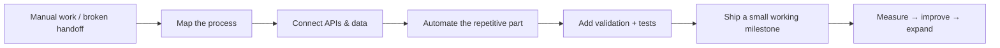

<div align="center">


<br/>


<br/>

[](mailto:serhii.drozdov.work@gmail.com)
[](https://www.linkedin.com/in/serhii-drozdov/)
[](https://contra.com/serhii_drozdov_5uqbrud7)

</div>

---

## I build the missing piece between **“we do this manually”** and **“it just works”**

I'm a Python backend developer focused on **business workflows, API integrations, automation and practical AI**.

I like work where software removes friction from a real process: connecting two systems that do not talk to each other, turning a spreadsheet-heavy routine into an API workflow, building a small internal tool, processing messy data, fixing a fragile backend integration, or adding an AI step where it actually saves time.

I can take a **small, clearly scoped paid milestone** first, ship it cleanly, and expand only if the result is useful.

### What I can build

| | |
|---|---|
| 🔌 **API & backend systems** | FastAPI services, REST APIs, third-party integrations, webhooks, backend fixes |
| ⚙️ **Business automation** | repetitive workflows, scheduled jobs, data movement, notifications, operational tooling |
| 🧠 **AI-enabled workflows** | OpenAI/LLM integrations, structured outputs, classification, extraction, assistant backends |
| 🗃️ **Data workflows** | PostgreSQL/SQL, pandas, validation, transformations, import/export pipelines |
| 🕸️ **Scraping & collection** | public-data collectors, scheduled monitoring, normalization and storage |
| 🛠️ **Internal tools** | small utilities, dashboards/backends, admin workflows and team-facing tools |
| 🌐 **Lightweight product surfaces** | landing pages and simple web interfaces when a backend/integration project needs one |
| 🧪 **Reliable delivery** | pytest, API validation, error handling, clean handoff and documentation |

---

## How I approach a workflow



The goal is not “more technology”. The goal is **less manual work, fewer fragile handoffs, and a system someone can actually use**.

---

## Stack I reach for

<div align="center">


</div>

**Also comfortable with:** JSON, CSV, cron/scheduled jobs, scraping, external SaaS APIs, data cleanup, integration debugging, and working inside existing codebases.

---

## Good reasons to message me

You probably do **not** need “a whole new platform”.

You may just need someone to take one annoying technical piece off your plate.

- “We copy this data between systems every day.”
- “This API integration keeps breaking.”
- “We need a FastAPI endpoint around an existing process.”
- “Our webhook/data flow is unreliable.”
- “We have a prototype and need the backend cleaned up.”
- “We need to turn PDFs / CSVs / form submissions into structured data.”
- “We want an LLM feature, but it needs to behave like a real backend component.”
- “There is a small backend item sitting in the backlog nobody has time for.”
- “We need a simple landing/product surface around an automation or service.”

If the task is bounded, I can usually tell you quickly whether I can take it.

---

## Ways we can work

```text
Small paid milestone
        ↓
Working implementation
        ↓
You evaluate the result
        ↓
Continue only if it makes sense
```

**Open to:** freelance • contract • subcontracting • agency overflow • small fixed-scope projects • longer backend engagements

📍 Ukraine · Remote  
🕒 Comfortable with European working hours  
🟢 Available to start with a clearly scoped task

---

## Current focus

I'm building and documenting more public examples around:

`FastAPI` · `API integrations` · `automation` · `webhooks` · `PostgreSQL` · `AI backend workflows`

The repositories here will increasingly show the same kind of systems I like to build for real businesses.

---

<div align="center">

### Have a backend, API or automation problem?

**Send me the rough task + expected result.**  
I'll tell you directly whether it's a fit.

[](mailto:serhii.drozdov.work@gmail.com)
[](https://www.linkedin.com/in/serhii-drozdov/)
[](https://contra.com/serhii_drozdov_5uqbrud7)

</div>
