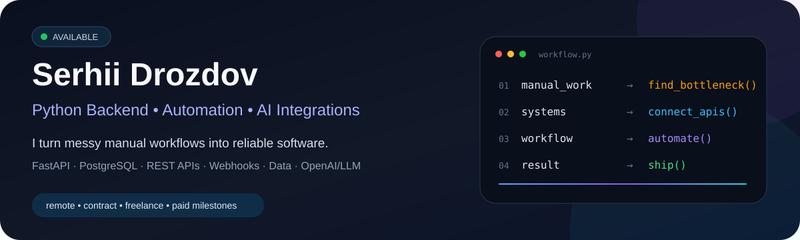
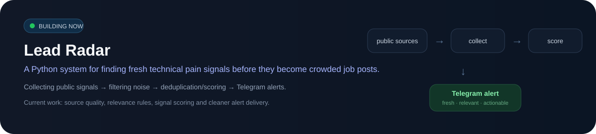
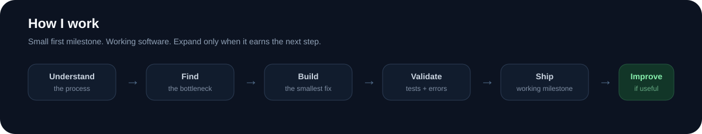
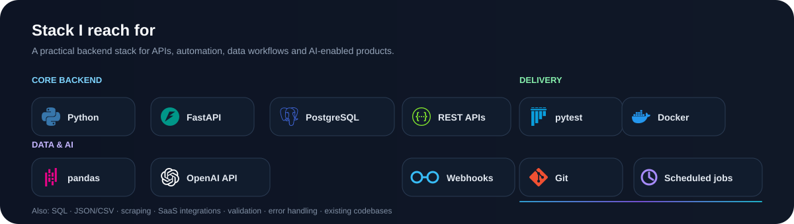
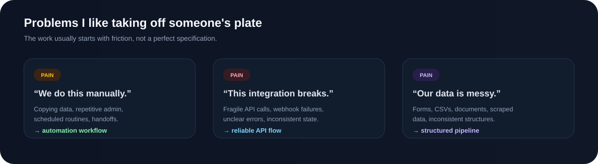
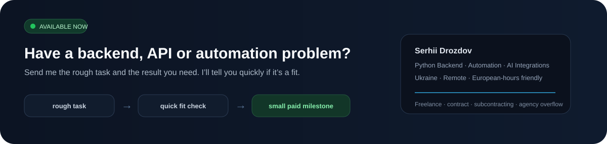

 

---

## I build the missing piece between **“we do this manually”** and **“it just works”**

I'm a Python backend developer focused on **business workflows, API integrations, automation and practical AI**.

I like projects where software removes friction from a real process: connecting systems, replacing repetitive manual work, cleaning up fragile integrations, structuring messy data, or adding AI where it genuinely saves time.

**Best fit:** a clearly scoped backend / integration / automation problem that needs to become a working, maintainable piece of software.

---

---

---

---

I can start with a **small paid milestone**, deliver a working implementation, and expand only if it makes sense.

---

**[Email](mailto:serhii.drozdov.work@gmail.com) · [LinkedIn](https://www.linkedin.com/in/serhii-drozdov/) · [Contra](https://contra.com/serhii_drozdov_5uqbrud7)**

